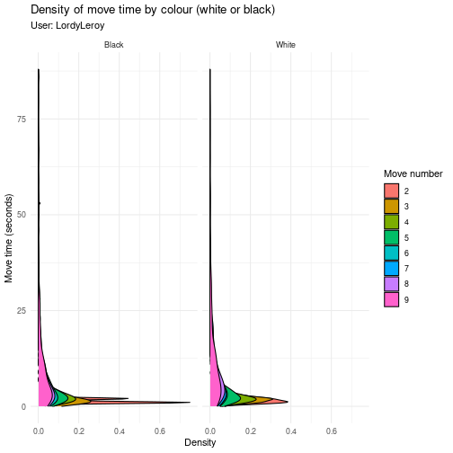
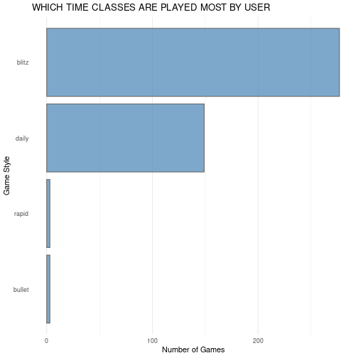
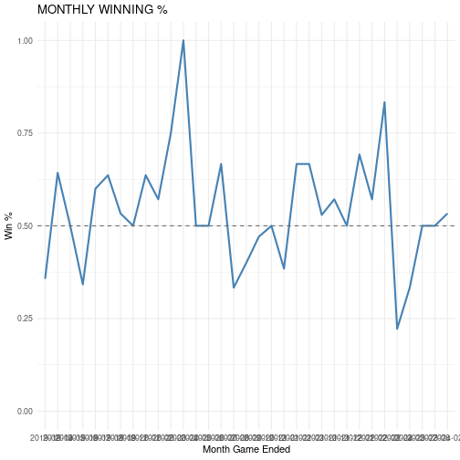
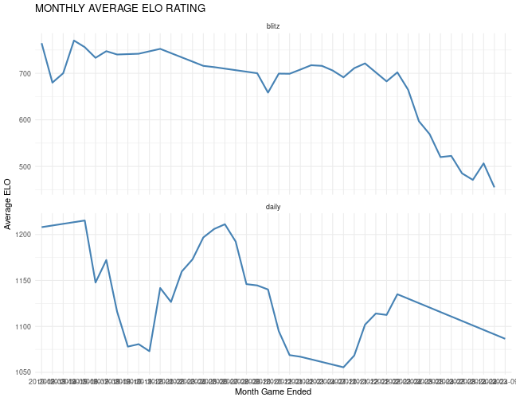
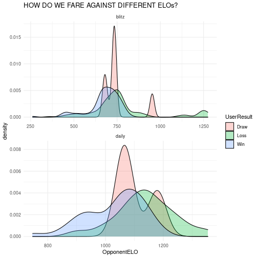

## Overview

This package is designed to allow users to extract game data from popular online chess platforms. The platforms currently supported in this package include:

* [chess.com](https://www.chess.com/)
* [Lichess](https://lichess.org/)

These websites offer a very convenient set of APIs to be able to access data and documentation to these can be found [here for chess.com](https://www.chess.com/news/view/published-data-api) and [here for Lichess](https://lichess.org/api).


## Installation

You can install the CRAN version of [**```chessR```** ](https://CRAN.R-project.org/package=chessR) with:


``` r
install.packages("chessR")
```

You can install the released version of [**```chessR```**](https://github.com/JaseZiv/chessR/) from [GitHub](https://github.com/JaseZiv/worldfootballR) with:


``` r
# install.packages("devtools")
devtools::install_github("JaseZiv/chessR")
```


``` r
library(chessR)
```


## Usage

The functions available in this package are designed to enable the extraction of chess game data.

### Data Extraction

The functions detailed below relate to extracting data from the chess gaming sites currently supported in this package.


#### Raw Game Data

The game extraction functions can take a vector of either single or multiple usernames. It will output a data frame with all the games played by that user.

As of version 1.2.2, `get_raw_chessdotcom()` now accepts an additional argument called `year_month`, a six digit integer of YYYYMM, which allows users to filter on which month(s) data is required for.

The functions are below.

**Note:**
These functions query an API, which is rate limited. The limiting rates for chess.com are unknown. For Lichess, the limit is throttled to 15 games per second. Queries could therefore take a few minutes if you're querying a lot of games.


``` r
# function to extract chess.com game data
chessdotcom_game_data_all_months <- get_raw_chessdotcom(usernames = "JaseZiv")
glimpse(chessdotcom_game_data_all_months)
#> Rows: 432
#> Columns: 25
#> $ GameRules       <chr> "chess", "chess", "chess", "chess", "chess", "chess", "chess", "chess", "chess", "c…
#> $ TimeClass       <chr> "blitz", "blitz", "blitz", "blitz", "blitz", "blitz", "blitz", "blitz", "blitz", "b…
#> $ Event           <chr> "Live Chess", "Live Chess", "Live Chess", "Live Chess", "Live Chess", "Live Chess",…
#> $ Site            <chr> "Chess.com", "Chess.com", "Chess.com", "Chess.com", "Chess.com", "Chess.com", "Ches…
#> $ Date            <chr> "2019-02-12", "2019-02-12", "2019-02-12", "2019-02-12", "2019-02-12", "2019-02-12",…
#> $ Round           <chr> "-", "-", "-", "-", "-", "-", "-", "-", "-", "-", "-", "-", "-", "-", "-", "-", "-"…
#> $ White           <chr> "JaseZiv", "Commander0101", "JaseZiv", "oscarbazan", "JaseZiv", "rojarosy", "JaseZi…
#> $ Black           <chr> "hKotla", "JaseZiv", "oscarbazan", "JaseZiv", "oscarbazan", "JaseZiv", "vinod87", "…
#> $ Result          <chr> "0-1", "1-0", "1-0", "1-0", "1-0", "0-1", "0-1", "0-1", "1-0", "0-1", "1-0", "0-1",…
#> $ CurrentPosition <chr> "rn4nr/pbB1kppp/4pq2/2pp2N1/4P2K/6P1/7P/5B1R w - -", "7Q/2kp1ppp/4pn2/1B6/pb1P4/4PN…
#> $ Timezone        <chr> "UTC", "UTC", "UTC", "UTC", "UTC", "UTC", "UTC", "UTC", "UTC", "UTC", "UTC", "UTC",…
#> $ ECO             <chr> "C00", "A40", "B00", "D02", "B00", "B40", "B00", "A00", "C42", "A04", "B21", "B50",…
#> $ ECOUrl          <chr> "https://www.chess.com/openings/French-Defense-Reti-Spielmann-Attack", "https://www…
#> $ UTCDate         <chr> "2019.02.12", "2019.02.12", "2019.02.12", "2019.02.12", "2019.02.12", "2019.02.12",…
#> $ UTCTime         <chr> "05:44:13", "07:45:57", "07:54:52", "07:55:50", "08:02:06", "08:39:19", "08:44:42",…
#> $ WhiteElo        <chr> "867", "757", "819", "792", "808", "797", "821", "773", "850", "722", "604", "704",…
#> $ BlackElo        <chr> "1102", "702", "783", "738", "783", "859", "922", "771", "744", "875", "680", "712"…
#> $ TimeControl     <chr> "180", "180", "180", "180", "180", "180", "180", "180", "180", "180", "180", "180",…
#> $ Termination     <chr> "hKotla won on time", "Commander0101 won on time", "JaseZiv won by checkmate", "osc…
#> $ StartTime       <chr> "05:44:13", "07:45:57", "07:54:52", "07:55:50", "08:02:06", "08:39:19", "08:44:42",…
#> $ EndDate         <chr> "2019-02-12", "2019-02-12", "2019-02-12", "2019-02-12", "2019-02-12", "2019-02-12",…
#> $ EndTime         <chr> "05:48:35", "07:51:41", "07:55:21", "08:01:40", "08:07:56", "08:43:42", "08:50:23",…
#> $ Link            <chr> "https://www.chess.com/game/live/3452526692", "https://www.chess.com/game/live/3452…
#> $ Moves           <chr> "1. e4 {[%clk 0:02:52.8]} 1... e6 {[%clk 0:02:59.8]} 2. g3 {[%clk 0:02:49.2]} 2... …
#> $ Username        <chr> "JaseZiv", "JaseZiv", "JaseZiv", "JaseZiv", "JaseZiv", "JaseZiv", "JaseZiv", "JaseZ…
```


``` r
# function to extract chess.com game data
chessdotcom_hikaru_recent <- get_raw_chessdotcom(usernames = "Hikaru", year_month = c(202104:202105))
glimpse(chessdotcom_hikaru_recent)
#> Rows: 903
#> Columns: 27
#> $ GameRules       <chr> "chess", "chess", "chess", "chess", "chess", "chess", "chess", "chess", "chess", "c…
#> $ TimeClass       <chr> "bullet", "bullet", "bullet", "bullet", "bullet", "bullet", "bullet", "bullet", "bu…
#> $ Event           <chr> "Live Chess", "Live Chess", "Live Chess", "Live Chess", "Live Chess", "Live Chess",…
#> $ Site            <chr> "Chess.com", "Chess.com", "Chess.com", "Chess.com", "Chess.com", "Chess.com", "Ches…
#> $ Date            <chr> "2021-04-01", "2021-04-01", "2021-04-01", "2021-04-01", "2021-04-01", "2021-04-01",…
#> $ Round           <chr> "-", "-", "-", "-", "-", "-", "-", "-", "-", "-", "-", "-", "-", "-", "-", "-", "-"…
#> $ White           <chr> "Lempire123", "Hikaru", "GMSrinath", "Hikaru", "Msb2", "Hikaru", "DrVelja", "Hikaru…
#> $ Black           <chr> "Hikaru", "SchmakAttack", "Hikaru", "Sanan_Sjugirov", "Hikaru", "ToivoK3", "Hikaru"…
#> $ Result          <chr> "0-1", "1-0", "0-1", "0-1", "0-1", "1-0", "0-1", "1-0", "1/2-1/2", "1/2-1/2", "1-0"…
#> $ CurrentPosition <chr> "1r1q1r1k/4n2p/p2pn1pP/1ppB4/P3Pp2/2NP4/1PP2PP1/2KR3R w - -", "1k2rb1r/pp3Bpp/8/4n2…
#> $ Timezone        <chr> "UTC", "UTC", "UTC", "UTC", "UTC", "UTC", "UTC", "UTC", "UTC", "UTC", "UTC", "UTC",…
#> $ ECO             <chr> "B06", "A06", "A04", "A04", "B06", "A06", "B15", "A34", "A40", "A01", "B11", "B06",…
#> $ ECOUrl          <chr> "https://www.chess.com/openings/Modern-Defense-with-1-e4-2.Nc3-Bg7", "https://www.c…
#> $ UTCDate         <chr> "2021.04.01", "2021.04.01", "2021.04.01", "2021.04.01", "2021.04.01", "2021.04.01",…
#> $ UTCTime         <chr> "16:00:00", "16:02:58", "16:05:37", "16:08:38", "16:11:43", "16:14:47", "16:17:39",…
#> $ WhiteElo        <chr> "2625", "3500", "2916", "3486", "2851", "3487", "3012", "3490", "3157", "3477", "34…
#> $ BlackElo        <chr> "3500", "2792", "3501", "2956", "3486", "2924", "3488", "3102", "3484", "3065", "31…
#> $ TimeControl     <chr> "60", "60", "60", "60", "60", "60", "60", "60", "60", "60", "60", "60", "60", "60",…
#> $ Termination     <chr> "Hikaru won by resignation", "Hikaru won by resignation", "Hikaru won on time", "Sa…
#> $ StartTime       <chr> "16:00:00", "16:02:58", "16:05:37", "16:08:38", "16:11:43", "16:14:47", "16:17:39",…
#> $ EndDate         <chr> "2021-04-01", "2021-04-01", "2021-04-01", "2021-04-01", "2021-04-01", "2021-04-01",…
#> $ EndTime         <chr> "16:01:09", "16:04:06", "16:08:15", "16:10:50", "16:13:18", "16:16:36", "16:20:13",…
#> $ Link            <chr> "https://www.chess.com/game/live/11031846815", "https://www.chess.com/game/live/110…
#> $ Moves           <chr> "1. e4 {[%clk 0:00:59.9]} 1... g6 {[%clk 0:00:59.9]} 2. Nc3 {[%clk 0:00:59.8]} 2...…
#> $ SetUp           <chr> NA, NA, NA, NA, NA, NA, NA, NA, NA, NA, NA, NA, NA, NA, NA, NA, NA, NA, NA, NA, NA,…
#> $ FEN             <chr> NA, NA, NA, NA, NA, NA, NA, NA, NA, NA, NA, NA, NA, NA, NA, NA, NA, NA, NA, NA, NA,…
#> $ Username        <chr> "Hikaru", "Hikaru", "Hikaru", "Hikaru", "Hikaru", "Hikaru", "Hikaru", "Hikaru", "Hi…
```


``` r
# function to extract lichess game data
lichess_game_data <- get_raw_lichess("Georges", since = "2024-06-01")
glimpse(lichess_game_data)
#> Rows: 0
#> Columns: 0
```

#### Analysis Data

The following function will extract the same data that the `get_raw_chessdotcom()` function will, however this function will also include additional columns to make analysing data easier.

The function can be used either on a single player, or a character vector of multiple players.

**Note:**
This is only available for chess.com extracts


``` r
chess_analysis_single <- get_game_data("JaseZiv")
```


``` r
glimpse(chess_analysis_single)
#> Rows: 431
#> Columns: 36
#> $ rules           <chr> "chess", "chess", "chess", "chess", "chess", "chess", "chess", "chess", "chess", "c…
#> $ time_class      <chr> "blitz", "blitz", "blitz", "blitz", "blitz", "blitz", "blitz", "blitz", "blitz", "b…
#> $ Event           <chr> "Live Chess", "Live Chess", "Live Chess", "Live Chess", "Live Chess", "Live Chess",…
#> $ Site            <chr> "Chess.com", "Chess.com", "Chess.com", "Chess.com", "Chess.com", "Chess.com", "Ches…
#> $ Date            <date> 2019-02-12, 2019-02-12, 2019-02-12, 2019-02-12, 2019-02-12, 2019-02-12, 2019-02-12…
#> $ Round           <chr> "-", "-", "-", "-", "-", "-", "-", "-", "-", "-", "-", "-", "-", "-", "-", "-", "-"…
#> $ White           <chr> "JaseZiv", "Commander0101", "JaseZiv", "oscarbazan", "JaseZiv", "rojarosy", "JaseZi…
#> $ Black           <chr> "hKotla", "JaseZiv", "oscarbazan", "JaseZiv", "oscarbazan", "JaseZiv", "vinod87", "…
#> $ Result          <chr> "0-1", "1-0", "1-0", "1-0", "1-0", "0-1", "0-1", "0-1", "1-0", "0-1", "1-0", "0-1",…
#> $ CurrentPosition <chr> "rn4nr/pbB1kppp/4pq2/2pp2N1/4P2K/6P1/7P/5B1R w - -", "7Q/2kp1ppp/4pn2/1B6/pb1P4/4PN…
#> $ Timezone        <chr> "UTC", "UTC", "UTC", "UTC", "UTC", "UTC", "UTC", "UTC", "UTC", "UTC", "UTC", "UTC",…
#> $ ECO             <chr> "C00", "A40", "B00", "D02", "B00", "B40", "B00", "A00", "C42", "A04", "B21", "B50",…
#> $ ECOUrl          <chr> "https://www.chess.com/openings/French-Defense-Reti-Spielmann-Attack", "https://www…
#> $ UTCDate         <chr> "2019.02.12", "2019.02.12", "2019.02.12", "2019.02.12", "2019.02.12", "2019.02.12",…
#> $ UTCTime         <chr> "05:44:13", "07:45:57", "07:54:52", "07:55:50", "08:02:06", "08:39:19", "08:44:42",…
#> $ WhiteElo        <chr> "867", "757", "819", "792", "808", "797", "821", "773", "850", "722", "604", "704",…
#> $ BlackElo        <chr> "1102", "702", "783", "738", "783", "859", "922", "771", "744", "875", "680", "712"…
#> $ TimeControl     <chr> "180", "180", "180", "180", "180", "180", "180", "180", "180", "180", "180", "180",…
#> $ Termination     <chr> "hKotla won on time", "Commander0101 won on time", "JaseZiv won by checkmate", "osc…
#> $ StartTime       <chr> "05:44:13", "07:45:57", "07:54:52", "07:55:50", "08:02:06", "08:39:19", "08:44:42",…
#> $ EndDate         <date> 2019-02-12, 2019-02-12, 2019-02-12, 2019-02-12, 2019-02-12, 2019-02-12, 2019-02-12…
#> $ EndTime         <chr> "05:48:35", "07:51:41", "07:55:21", "08:01:40", "08:07:56", "08:43:42", "08:50:23",…
#> $ Link            <chr> "https://www.chess.com/game/live/3452526692", "https://www.chess.com/game/live/3452…
#> $ Moves           <chr> "\n1. e4 {[%clk 0:02:52.8]} 1... e6 {[%clk 0:02:59.8]} 2. g3 {[%clk 0:02:49.2]} 2..…
#> $ winner          <chr> "Black", "White", "White", "White", "White", "Black", "Black", "Black", "White", "B…
#> $ Username        <chr> "JaseZiv", "JaseZiv", "JaseZiv", "JaseZiv", "JaseZiv", "JaseZiv", "JaseZiv", "JaseZ…
#> $ n_Moves         <dbl> 21, 28, 5, 29, 25, 10, 26, 31, 35, 41, 29, 7, 35, 33, 29, 14, 2, 11, 19, 44, 13, 14…
#> $ UserOpponent    <chr> "hKotla", "Commander0101", "oscarbazan", "oscarbazan", "oscarbazan", "rojarosy", "v…
#> $ UserColour      <chr> "White", "Black", "White", "Black", "White", "Black", "White", "White", "Black", "W…
#> $ OpponentColour  <chr> "Black", "White", "Black", "White", "Black", "White", "Black", "Black", "White", "B…
#> $ UserELO         <dbl> 867, 702, 819, 738, 808, 859, 821, 773, 744, 722, 680, 712, 696, 680, 653, 625, 649…
#> $ OpponentELO     <dbl> 1102, 757, 783, 792, 783, 797, 922, 771, 850, 875, 604, 704, 884, 868, 692, 666, 52…
#> $ UserResult      <chr> "Loss", "Loss", "Win", "Loss", "Win", "Win", "Loss", "Loss", "Loss", "Loss", "Loss"…
#> $ DaysTaken       <drtn> 0 days, 0 days, 0 days, 0 days, 0 days, 0 days, 0 days, 0 days, 0 days, 0 days, 0 …
#> $ GameEnding      <chr> "on time", "on time", "by checkmate", "on time", "on time", "on time", "on time", "…
#> $ Opening         <chr> "Defense-Reti-Spielmann-Attack", "Pawn-Opening-Polish-Defense", "Pawn-Opening-St-Ge…
```


### Leaderboards

The leaderboards of each game platform can be extracted for a number of different games available on each platform. Each are discussed below:

#### Chess.com

The below function allows the user to extract the top 50 players of each game type specified. Game types available include:

> *"daily","daily960", "live_rapid", "live_blitz", "live_bullet", "live_bughouse", "live_blitz960", "live_threecheck", "live_crazyhouse", "live_kingofthehill", "lessons", "tactics"*

The usernames that are contained in the results can then be passed to `get_raw_chessdotcom` outlined above.


``` r
daily_leaders <- chessdotcom_leaderboard(game_type = "daily")
glimpse(daily_leaders)
#> Rows: 50
#> Columns: 16
#> $ player_id   <int> 2305524, 32506052, 52897514, 7848044, 1946148, 1967855, 39668580, 44902306, 338211701, …
#> $ url         <chr> "https://www.chess.com/member/Zgorl", "https://www.chess.com/member/JolinTsai", "https:…
#> $ username    <chr> "Zgorl", "JolinTsai", "FormerProdigy", "francisbegbie", "dumplings", "cschess", "Castle…
#> $ score       <int> 2568, 2552, 2519, 2509, 2503, 2490, 2478, 2469, 2453, 2444, 2437, 2434, 2421, 2420, 241…
#> $ rank        <int> 1, 2, 3, 4, 5, 6, 7, 8, 9, 10, 11, 12, 13, 14, 15, 16, 17, 18, 19, 20, 21, 22, 23, 24, …
#> $ country     <chr> "https://api.chess.com/pub/country/NL", "https://api.chess.com/pub/country/TW", "https:…
#> $ title       <chr> "FM", "GM", "GM", "FM", NA, "FM", NA, "IM", NA, "FM", NA, "FM", NA, "CM", "IM", "IM", N…
#> $ name        <chr> "Rob Schoorl", "蔡依林", "David Navara", "Andy Mack", NA, "Charles Schulien", "Matt", "…
#> $ status      <chr> "premium", "premium", "premium", "premium", "premium", "premium", "premium", "premium",…
#> $ avatar      <chr> "https://images.chesscomfiles.com/uploads/v1/user/2305524.5341b605.200x200o.67a89f6c51b…
#> $ trend_score <df[,2]> <data.frame[36 x 2]>
#> $ trend_rank  <df[,2]> <data.frame[36 x 2]>
#> $ flair_code  <chr> "white_bishop", "diamond_pink", "flag_ukraine", "diamond_traditional", "diamond_trad…
#> $ win_count   <int> 547, 446, 19, 726, 418, 107, 125, 391, 86, 443, 68, 113, 60, 369, 162, 267, 3, 24, 7…
#> $ loss_count  <int> 207, 9, 0, 4, 2, 11, 23, 3, 5, 119, 5, 24, 14, 19, 18, 23, 0, 7, 26, 62, 6, 13, 27, 24,…
#> $ draw_count  <int> 67, 52, 11, 6, 4, 23, 34, 13, 8, 74, 1, 26, 24, 56, 57, 54, 0, 13, 14, 7, 46, 32, 41, 4…
```


#### Lichess

The `get_lichess_leaderboard()` function takes in two parameters; how many players you want returned (with a max of 200 being returned) and the speed variant. Speed variants include;

> *"ultraBullet", "bullet", "blitz", "rapid", "classical", "chess960", "crazyhouse", "antichess", "atomic", "horde", "kingOfTheHill", "racingKings", "threeCheck"*


``` r
lichess_leaders <- lichess_leaderboard(top_n_players = 10, speed_variant = "blitz")
glimpse(lichess_leaders)
```


### Analysis Functions

This section will detail some of the functions to use for extracting information from the raw games data extracts for analysis.

#### Number of moves in the game

To be able to see how many moves a game lasted, the `return_num_moves` function can be used.

It will parse through the *Moves* column in the extracted data frame and return a vector of moves, each one being for each game.


``` r
# function to extract the number of moves in each game
chessdotcom_game_data_all_months$nMoves <- return_num_moves(moves_string = chessdotcom_game_data_all_months$Moves)

# inspect output
head(chessdotcom_game_data_all_months[, c("Moves", "nMoves")])
#>                                                                                                                                                                                                                                                                                                                                                                                                                                                                                                                                                                                                                                                                                                                                                                                                                                                                                                                                                                                                                                                                                                                                                                                                                                                                                                                                                                                                                                                                                                                                                                                                                                   Moves
#> 1                                                                                                                                                                                                                                                                                                                                                                                                                            1. e4 {[%clk 0:02:52.8]} 1... e6 {[%clk 0:02:59.8]} 2. g3 {[%clk 0:02:49.2]} 2... b6 {[%clk 0:02:58.3]} 3. Nf3 {[%clk 0:02:47.5]} 3... Bb7 {[%clk 0:02:57.2]} 4. d3 {[%clk 0:02:42.3]} 4... Qf6 {[%clk 0:02:54.3]} 5. Na3 {[%clk 0:02:34.8]} 5... d5 {[%clk 0:02:52.4]} 6. Bg5 {[%clk 0:02:21.4]} 6... Qxb2 {[%clk 0:02:49.7]} 7. Rb1 {[%clk 0:02:18.7]} 7... Qxa3 {[%clk 0:02:48.2]} 8. Qc1 {[%clk 0:02:02.5]} 8... Qc3+ {[%clk 0:02:45.8]} 9. Qd2 {[%clk 0:01:46.2]} 9... Qa3 {[%clk 0:02:42.5]} 10. Bf4 {[%clk 0:01:39.9]} 10... Kd7 {[%clk 0:02:38.6]} 11. Qb4 {[%clk 0:01:27.2]} 11... Bxb4+ {[%clk 0:02:36.1]} 12. Ke2 {[%clk 0:01:14.6]} 12... Bc5 {[%clk 0:02:29]} 13. Ng5 {[%clk 0:01:08.9]} 13... Ke7 {[%clk 0:02:21.9]} 14. Bh3 {[%clk 0:01:00]} 14... Qxa2 {[%clk 0:02:19.3]} 15. Rb5 {[%clk 0:00:50.1]} 15... Qxc2+ {[%clk 0:02:16.1]} 16. Kf3 {[%clk 0:00:43.7]} 16... Qxf2+ {[%clk 0:02:13.7]} 17. Kg4 {[%clk 0:00:31]} 17... Qe2+ {[%clk 0:02:11.4]} 18. Kh4 {[%clk 0:00:27.3]} 18... Qxd3 {[%clk 0:02:07.9]} 19. Bf1 {[%clk 0:00:20]} 19... Qd4 {[%clk 0:01:55.1]} 20. Bxc7 {[%clk 0:00:13.2]} 20... Qf6 {[%clk 0:01:51.6]} 21. Rxc5 {[%clk 0:00:03.4]} 21... bxc5 {[%clk 0:01:49.3]} 0-1
#> 2                                                              1. d4 {[%clk 0:02:59.9]} 1... b5 {[%clk 0:02:58.2]} 2. e3 {[%clk 0:02:58.5]} 2... e6 {[%clk 0:02:57]} 3. Nf3 {[%clk 0:02:57.5]} 3... Bb7 {[%clk 0:02:55.4]} 4. Be2 {[%clk 0:02:52.9]} 4... Nc6 {[%clk 0:02:54.7]} 5. c3 {[%clk 0:02:51.4]} 5... Bd6 {[%clk 0:02:50.2]} 6. b4 {[%clk 0:02:49.6]} 6... a5 {[%clk 0:02:46.2]} 7. a3 {[%clk 0:02:46]} 7... axb4 {[%clk 0:02:39.7]} 8. a4 {[%clk 0:02:43]} 8... bxa4 {[%clk 0:02:37.2]} 9. cxb4 {[%clk 0:02:40.3]} 9... Nxb4 {[%clk 0:02:32.9]} 10. Na3 {[%clk 0:02:30.6]} 10... Qf6 {[%clk 0:02:25.8]} 11. Rb1 {[%clk 0:02:21.1]} 11... Qf5 {[%clk 0:02:21.8]} 12. Rb2 {[%clk 0:02:05.4]} 12... Qb1 {[%clk 0:02:21.3]} 13. Nb5 {[%clk 0:01:55.6]} 13... Qe4 {[%clk 0:02:11.7]} 14. Nxc7+ {[%clk 0:01:52]} 14... Kd8 {[%clk 0:02:07]} 15. Nxa8 {[%clk 0:01:49.6]} 15... Bxa8 {[%clk 0:02:05.8]} 16. O-O {[%clk 0:01:47.2]} 16... Qg4 {[%clk 0:01:59.6]} 17. Re1 {[%clk 0:01:32.4]} 17... Nf6 {[%clk 0:01:53.6]} 18. Kf1 {[%clk 0:01:29.1]} 18... Nbd5 {[%clk 0:01:32]} 19. h3 {[%clk 0:01:14.1]} 19... Nc3 {[%clk 0:01:30.1]} 20. Qc2 {[%clk 0:01:04.6]} 20... Qe4 {[%clk 0:01:23.2]} 21. Qxc3 {[%clk 0:01:00]} 21... Nh5 {[%clk 0:01:12.8]} 22. Bd3 {[%clk 0:00:56.6]} 22... Qd5 {[%clk 0:00:55.7]} 23. Rb5 {[%clk 0:00:47.2]} 23... Qxb5 {[%clk 0:00:38.2]} 24. Bxb5 {[%clk 0:00:45]} 24... Nf6 {[%clk 0:00:28.7]} 25. Qa5+ {[%clk 0:00:42.6]} 25... Kc8 {[%clk 0:00:24.6]} 26. Qxa8+ {[%clk 0:00:39.4]} 26... Kc7 {[%clk 0:00:22.6]} 27. Qxh8 {[%clk 0:00:34.5]} 27... Bb4 {[%clk 0:00:00.2]} 28. Rd1 {[%clk 0:00:30]} 1-0
#> 3                                                                                                                                                                                                                                                                                                                                                                                                                                                                                                                                                                                                                                                                                                                                                                                                                                                                                                                                                                                                                                                                                                                                                                                                                                                                                                                                                                                        1. e4 {[%clk 0:02:59.8]} 1... a6 {[%clk 0:02:58.5]} 2. c3 {[%clk 0:02:58.7]} 2... f6 {[%clk 0:02:55.7]} 3. Na3 {[%clk 0:02:57.5]} 3... h6 {[%clk 0:02:52.2]} 4. Qh5+ {[%clk 0:02:52]} 4... g6 {[%clk 0:02:43]} 5. Qxg6# {[%clk 0:02:50.4]} 1-0
#> 4 1. Nf3 {[%clk 0:02:59.9]} 1... d5 {[%clk 0:02:59.3]} 2. d4 {[%clk 0:02:58.7]} 2... f6 {[%clk 0:02:57.2]} 3. g4 {[%clk 0:02:55.3]} 3... Bxg4 {[%clk 0:02:53.4]} 4. Nh4 {[%clk 0:02:49]} 4... Nc6 {[%clk 0:02:51.2]} 5. f3 {[%clk 0:02:47.7]} 5... Be6 {[%clk 0:02:45.5]} 6. b3 {[%clk 0:02:41.1]} 6... Nh6 {[%clk 0:02:42.3]} 7. Rg1 {[%clk 0:02:36]} 7... b5 {[%clk 0:02:38.6]} 8. Nd2 {[%clk 0:02:33.3]} 8... Nxd4 {[%clk 0:02:35.9]} 9. c3 {[%clk 0:02:30.7]} 9... Ndf5 {[%clk 0:02:25.2]} 10. e4 {[%clk 0:02:29.3]} 10... Nxh4 {[%clk 0:02:23.1]} 11. exd5 {[%clk 0:02:27.4]} 11... Bxd5 {[%clk 0:02:20.7]} 12. f4 {[%clk 0:02:23.2]} 12... Bf3 {[%clk 0:02:15.9]} 13. Bxb5+ {[%clk 0:02:19.9]} 13... Kf7 {[%clk 0:02:05.1]} 14. Nxf3 {[%clk 0:02:18.3]} 14... Nxf3+ {[%clk 0:02:03]} 15. Qxf3 {[%clk 0:02:16.2]} 15... e6 {[%clk 0:01:54.8]} 16. h4 {[%clk 0:02:01.4]} 16... Qd5 {[%clk 0:01:49.1]} 17. c4 {[%clk 0:01:50.3]} 17... Qd8 {[%clk 0:01:25.6]} 18. f5 {[%clk 0:01:41.9]} 18... Nxf5 {[%clk 0:01:19.3]} 19. h5 {[%clk 0:01:33.8]} 19... h6 {[%clk 0:01:10.1]} 20. Qg2 {[%clk 0:01:18.6]} 20... Rc8 {[%clk 0:01:04.4]} 21. Qg6+ {[%clk 0:01:16.5]} 21... Ke7 {[%clk 0:00:54.1]} 22. Ba3+ {[%clk 0:01:15.2]} 22... Nd6 {[%clk 0:00:39.8]} 23. Kf2 {[%clk 0:00:58.5]} 23... c6 {[%clk 0:00:38.3]} 24. Rae1 {[%clk 0:00:56.9]} 24... Qb6+ {[%clk 0:00:36]} 25. Kg2 {[%clk 0:00:54.3]} 25... Kd8 {[%clk 0:00:20.7]} 26. Rxe6 {[%clk 0:00:43.4]} 26... Kd7 {[%clk 0:00:08.5]} 27. Rge1 {[%clk 0:00:37.5]} 27... Nxb5 {[%clk 0:00:03]} 28. Rd1+ {[%clk 0:00:32.3]} 28... Kc7 {[%clk 0:00:00.4]} 29. Qg3+ {[%clk 0:00:25]} 1-0
#> 5                                                                                                                                                                                                                                     1. e4 {[%clk 0:02:59.2]} 1... Nc6 {[%clk 0:02:59.1]} 2. g3 {[%clk 0:02:57.5]} 2... e6 {[%clk 0:02:54.1]} 3. b3 {[%clk 0:02:47.5]} 3... d6 {[%clk 0:02:53.1]} 4. Nc3 {[%clk 0:02:44.9]} 4... e5 {[%clk 0:02:52]} 5. Nf3 {[%clk 0:02:35.7]} 5... g6 {[%clk 0:02:46.9]} 6. Ba3 {[%clk 0:02:30.8]} 6... Bg4 {[%clk 0:02:42.2]} 7. Be2 {[%clk 0:02:25.6]} 7... h5 {[%clk 0:02:40.3]} 8. Ng5 {[%clk 0:02:20.7]} 8... Qxg5 {[%clk 0:02:33.9]} 9. h3 {[%clk 0:02:18.2]} 9... Be6 {[%clk 0:02:25.6]} 10. h4 {[%clk 0:02:15]} 10... Qf6 {[%clk 0:02:20.4]} 11. Bc4 {[%clk 0:02:00.7]} 11... g5 {[%clk 0:02:13.3]} 12. O-O {[%clk 0:01:58.1]} 12... gxh4 {[%clk 0:02:11.3]} 13. gxh4 {[%clk 0:01:55.4]} 13... Nge7 {[%clk 0:02:01.3]} 14. f4 {[%clk 0:01:38.9]} 14... Rg8+ {[%clk 0:01:59.4]} 15. Kf2 {[%clk 0:01:32.4]} 15... Bg4 {[%clk 0:01:49.6]} 16. Qe1 {[%clk 0:01:25.2]} 16... Qxf4+ {[%clk 0:01:45.8]} 17. Kg1 {[%clk 0:01:22.8]} 17... Bh3+ {[%clk 0:01:38]} 18. Kh1 {[%clk 0:01:07.3]} 18... Qg4 {[%clk 0:01:17.8]} 19. Rg1 {[%clk 0:01:02]} 19... Qf3+ {[%clk 0:01:14.2]} 20. Kh2 {[%clk 0:00:56.9]} 20... Qf4+ {[%clk 0:00:59]} 21. Kh1 {[%clk 0:00:51.9]} 21... Nd4 {[%clk 0:00:49.2]} 22. Rxg8 {[%clk 0:00:49.6]} 22... Nf3 {[%clk 0:00:44.6]} 23. Qf2 {[%clk 0:00:40.6]} 23... Nh2 {[%clk 0:00:08.5]} 24. Qxh2 {[%clk 0:00:34]} 24... Qf3+ {[%clk 0:00:04.7]} 25. Kg1 {[%clk 0:00:22.3]} 1-0
#> 6                                                                                                                                                                                                                                                                                                                                                                                                                                                                                                                                                                                                                                                                                                                                                                                                                                                                                                                                                                                                                                                                          1. e4 {[%clk 0:02:59.9]} 1... c5 {[%clk 0:02:57.8]} 2. Nf3 {[%clk 0:02:58.9]} 2... e6 {[%clk 0:02:56]} 3. g3 {[%clk 0:02:57.5]} 3... Qa5 {[%clk 0:02:50.9]} 4. Nc3 {[%clk 0:02:55.9]} 4... Bd6 {[%clk 0:02:38.1]} 5. d3 {[%clk 0:02:41.9]} 5... Nf6 {[%clk 0:02:33.9]} 6. Bd2 {[%clk 0:02:37.8]} 6... e5 {[%clk 0:02:27.5]} 7. Bg2 {[%clk 0:02:35.5]} 7... Qb6 {[%clk 0:02:15.8]} 8. O-O {[%clk 0:02:23.9]} 8... Ng4 {[%clk 0:02:10.8]} 9. Ng5 {[%clk 0:02:19.2]} 9... Qxb2 {[%clk 0:01:52.8]} 10. Qxg4 {[%clk 0:02:13.5]} 10... Qxc2 {[%clk 0:01:42.1]} 0-1
#>   nMoves
#> 1     21
#> 2     28
#> 3      5
#> 4     29
#> 5     25
#> 6     10
```

#### How the game ended

The chess.com data extract doesn't have how the game ended on its own. To get the game ending on its own, the `get_game_ending` function can be used.


``` r
# function to extract the ending of chess.com data
chessdotcom_game_data_all_months$Ending <- mapply(get_game_ending,
                                                  termination_string = chessdotcom_game_data_all_months$Termination,
                                                  white = chessdotcom_game_data_all_months$White,
                                                  black = chessdotcom_game_data_all_months$Black)

# inspect output
head(chessdotcom_game_data_all_months[, c("Termination", "White", "Black", "Ending")])
#>                 Termination         White      Black       Ending
#> 1        hKotla won on time       JaseZiv     hKotla      on time
#> 2 Commander0101 won on time Commander0101    JaseZiv      on time
#> 3  JaseZiv won by checkmate       JaseZiv oscarbazan by checkmate
#> 4    oscarbazan won on time    oscarbazan    JaseZiv      on time
#> 5       JaseZiv won on time       JaseZiv oscarbazan      on time
#> 6       JaseZiv won on time      rojarosy    JaseZiv      on time
```


#### Game Winner

Given two players, one playing on white and the other on black, we want to be able to know the username of the winner. To get this information, use the `get_winner` function.


``` r
# function to extract the winner of each game
chessdotcom_game_data_all_months$Winner <- get_winner(result_column = chessdotcom_game_data_all_months$Result, 
                                                      white = chessdotcom_game_data_all_months$White, 
                                                      black = chessdotcom_game_data_all_months$Black)

# inspect output
head(chessdotcom_game_data_all_months[, c("White", "Black", "Result", "Winner")])
#>           White      Black Result        Winner
#> 1       JaseZiv     hKotla    0-1        hKotla
#> 2 Commander0101    JaseZiv    1-0 Commander0101
#> 3       JaseZiv oscarbazan    1-0       JaseZiv
#> 4    oscarbazan    JaseZiv    1-0    oscarbazan
#> 5       JaseZiv oscarbazan    1-0       JaseZiv
#> 6      rojarosy    JaseZiv    0-1       JaseZiv
```

#### Lichess clock and move times

Extract the clock time and move times from a Lichess games list, using the `lichess_clock_move_time` function.


``` r
# Get Lichess game data
lichess_game_data <- get_raw_lichess("LordyLeroy", since = "2024-08-01")

lichess_game_data_with_time <- lichess_clock_move_time(games_list = lichess_game_data)

head(lichess_game_data_with_time)
#> # A tibble: 6 × 7
#>   Site                         White      Black      colour move_number clock_time             move_time 
#>   <chr>                        <chr>      <chr>      <chr>        <dbl> <Duration>             <Duration>
#> 1 https://lichess.org/96PSCywU LordyLeroy chaplayy12 White            1 1200s (~20 minutes)    0s        
#> 2 https://lichess.org/96PSCywU LordyLeroy chaplayy12 Black            1 1200s (~20 minutes)    0s        
#> 3 https://lichess.org/96PSCywU LordyLeroy chaplayy12 White            2 1199s (~19.98 minutes) 1s        
#> 4 https://lichess.org/96PSCywU LordyLeroy chaplayy12 Black            2 1196s (~19.93 minutes) 4s        
#> 5 https://lichess.org/96PSCywU LordyLeroy chaplayy12 White            3 1189s (~19.82 minutes) 10s       
#> 6 https://lichess.org/96PSCywU LordyLeroy chaplayy12 Black            3 1194s (~19.9 minutes)  2s
```

For example, plot how move times tend to increase with increased move number in the opening with black, compared to white.


``` r

username <- "LordyLeroy"

ggplot(lichess_game_data_with_time %>%
         filter((White == username & colour == "White") |
                  (Black == username & colour == "Black"),
                between(move_number, 2, 9),
                move_time <= 100),
       aes(x = move_time,
           fill = as.factor(move_number))) +
  geom_density() +
  coord_flip() +
  labs(x = "Move time (seconds)",
       y = "Density",
       fill = "Move number",
       title = "Density of move time by colour (white or black)",
       subtitle = paste0("User: ", username)) +
  theme_minimal() +
  facet_wrap(~ colour)
```




## Bonus: Basic EDA Analysing Games

This section will perform some exploratory data analysis on the data extracted by `get_raw_chessdotcom()`, and then having used some of the analysis functions explained above. It is by no means an exhaustive list of topics to analyse, rather, it is designed to give the user a few ideas of what can be done with the analysis data provided.


``` r
chessdotcom_game_data_all_months %>% 
  count(TimeClass) %>% 
  ggplot(aes(x= reorder(TimeClass,n), y= n)) +
  geom_col(fill = "steelblue", colour = "grey40", alpha = 0.7) +
  labs(x= "Game Style", y= "Number of Games") +
  ggtitle("WHICH TIME CLASSES ARE PLAYED MOST BY USER") +
  coord_flip() +
  theme_minimal() +
  theme(panel.grid.major.y = element_blank())
```




``` r
chessdotcom_game_data_all_months %>%
  mutate(MonthEnd = paste(year(EndDate), str_pad(lubridate::month(ymd(EndDate)), 2, side = "left", pad = "0"), sep = "-")) %>% 
  mutate(UserResult = ifelse(Winner == Username, "Win", ifelse(Winner == "Draw", "Draw", "Loss"))) %>% 
  group_by(MonthEnd, UserResult) %>% 
  summarise(n = n()) %>% 
  mutate(WinPercentage = n / sum(n)) %>% 
  filter(UserResult == "Win") %>% 
  ggplot(aes(x= MonthEnd, y= WinPercentage, group=1)) +
  geom_line(colour= "steelblue", size=1) +
  geom_hline(yintercept = 0.5, linetype = 2, colour = "grey40") +
  scale_y_continuous(limits = c(0,1)) +
  labs(x= "Month Game Ended", y= "Win %") +
  ggtitle("MONTHLY WINNING %") +
  theme_minimal()
```




``` r
chessdotcom_game_data_all_months %>%
  filter(TimeClass %in% c("blitz", "daily")) %>% 
  mutate(UserELO = as.numeric(ifelse(Username == White, WhiteElo, BlackElo))) %>% 
  mutate(MonthEnd = paste(year(EndDate), str_pad(lubridate::month(ymd(EndDate)), 2, side = "left", pad = "0"), sep = "-")) %>% 
  group_by(MonthEnd, TimeClass) %>% 
  summarise(AverageELO = mean(UserELO, na.rm = T)) %>% 
  ggplot(aes(x= MonthEnd, y= AverageELO, group=1)) +
  geom_line(colour= "steelblue", size=1) +
  labs(x= "Month Game Ended", y= "Average ELO") +
  ggtitle("MONTHLY AVERAGE ELO RATING") +
  facet_wrap(~ TimeClass, scales = "free_y", ncol = 1) +
  theme_minimal()
```




``` r
chessdotcom_game_data_all_months %>% 
  mutate(OpponentELO = as.numeric(ifelse(Username == White, BlackElo, WhiteElo)),
         UserResult = ifelse(Winner == Username, "Win", ifelse(Winner == "Draw", "Draw", "Loss"))) %>% 
  filter(TimeClass %in% c("blitz", "daily")) %>% 
  ggplot(aes(x= OpponentELO, fill = UserResult)) +
  geom_density(alpha = 0.3) +
  ggtitle("HOW DO WE FARE AGAINST DIFFERENT ELOs?") +
  facet_wrap(~ TimeClass, scales = "free", ncol = 1) +
  theme_minimal()
```




